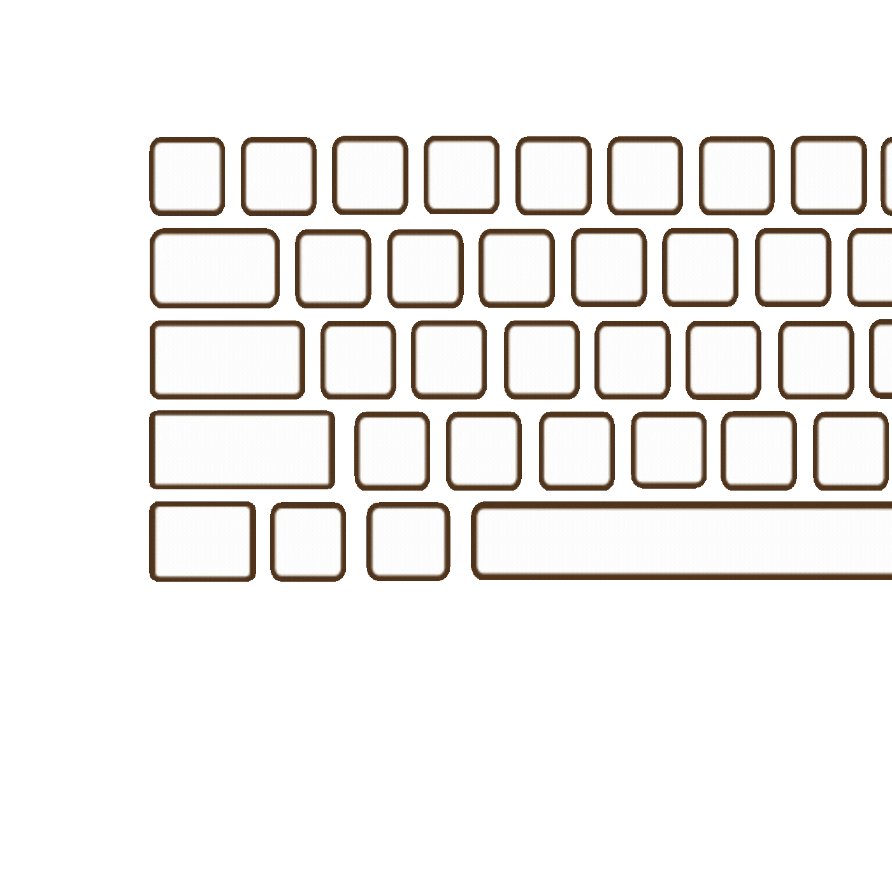

<div align="center">
  
# ProKeys

[](https://github.com/yourusername/prokeys)
[](https://github.com/yourusername/prokeys/releases)
[](LICENSE)

</div>

<div align="center">
  
</div>

## Installation

**TL;DR:** I'm too broke to shell out $100/year for an Apple Developer certificate just for this little project, so no fancy signed binaries for you! 🤷‍♂️

**The good news:** Everything you need is right here! Just run the build script and create your own macOS application:

```bash
./build-app.sh
```

This magical script will:
- Check all your dependencies (and yell at you if something's missing)
- Build a perfectly functional ProKeys app
- Create a DMG file you can actually use
- Give you step-by-step instructions for dealing with macOS's trust issues

**Why this approach?** Because $100/year > my current budget for side projects, and honestly, building it yourself is more fun anyway. Plus, you get the satisfaction of knowing exactly what's in your app!

The resulting app will be "self-signed" (fancy talk for "your Mac built it, so it should trust it"), and after a one-time security dance with macOS, it'll work just like any other app.

## What is ProKeys?

A minimal utility that re-types clipboard content with perfect indentation and zero system interference. Set your preferred words-per-minute rate, press `⌘⇧V`, and watch your text appear keystroke by keystroke with precise formatting—perfect for coding, note-taking, or anywhere a regular paste isn't enough.

**Key Features:**
- **Perfect macOS Integration**: Tailored specifically for macOS US keyboard layout with 1:1 key correspondence
- **Smart Indentation**: Preserves exact code indentation structure regardless of IDE auto-indent behavior
- **Zero Interference**: No system shortcuts, emoji panels, or app switching interruptions during typing
- **Hybrid Approach**: Combines proven indentation handling with interference-free content typing

Inspired by **AutoHotKey** on Windows, ProKeys delivers focused functionality purpose-built for ultra-fast paste on macOS.

## Tech Stack

- **Electron** – Native macOS window, auto-update, and system tray integration
- **Node.js** – Main process orchestration and IPC messaging
- **Python Hybrid Approach** – Combines `pynput` for precise indentation handling with `PyAutoGUI` for interference-free content typing
- **HTML/CSS/Vanilla JS** – Minimal interface with clean styling

## Codebase Overview

- **`main.js`** – Electron app initialization, global shortcut registration, and IPC coordination
- **`prokeys.py`** – Hybrid keyboard automation using `pynput` for indentation and `PyAutoGUI` for content typing
- **`renderer.js`** – UI logic and user interaction handling
- **`index.html` & `styles.css`** – Lightweight frontend with minimal styling
- **`build-app.sh`** – Complete build script for creating macOS application bundle

Additional files include build scripts, auto-updater configuration, and packaging artifacts.

---

**Created by [Lakshman Turlapati](https://www.audienclature.com)**